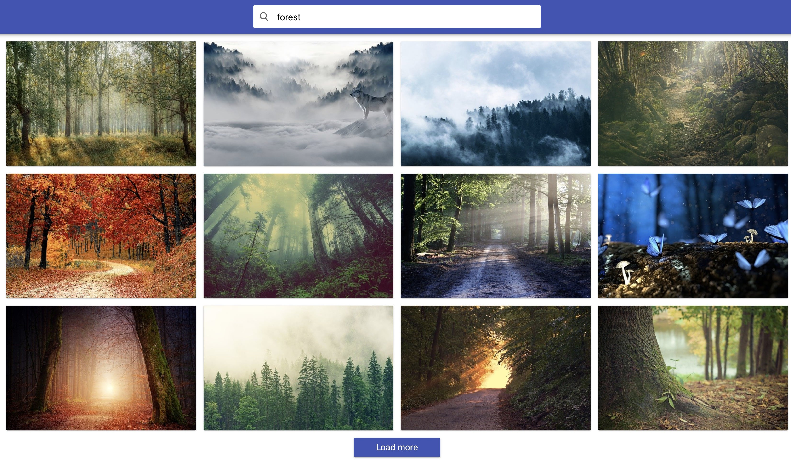
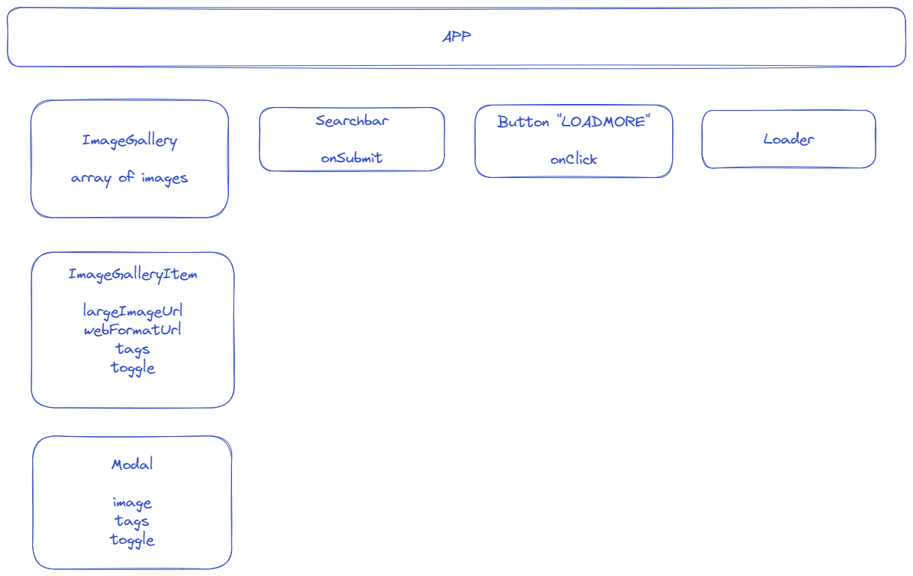

# goit-react-hw-03

=======

## Домашнє завдання

- [**Шаблон React-проекту**](https://github.com/goitacademy/react-homework-template#readme)

### Task #2-2

`Пошук зображень`

Напиши застосунок пошуку зображень за ключовим словом.

Створи компоненти `<Searchbar>`, `<ImageGallery>`, `<ImageGalleryItem>`,
`<Loader>`, `<Button>` і `<Modal>`.



#### Інструкція Pixabay API

Для HTTP-запитів використовуй публічний сервіс пошуку зображень
[**Pixabay**](https://pixabay.com/api/docs/).

URL-рядок HTTP-запиту.

```html
https://pixabay.com/api/?q=cat&page=1&key=your_key&image_type=photo&orientation=horizontal&per_page=12
```

Pixabay API підтримує пагінацію, за замовчуванням параметр `page` дорівнює `1`.
Нехай у відповіді надходить по 12 об'єктів, встановлено в параметрі `per_page`.
Не забудь, що під час пошуку за новим ключовим словом, необхідно скидати
значення `page` до `1`.

У відповіді від апі приходить масив об'єктів, в яких тобі цікаві лише наступні
властивості.

- `id` - унікальний ідентифікатор
- `webformatURL` - посилання на маленьке зображення для списку карток
- `largeImageURL` - посилання на велике зображення для модального вікна

#### Опис компонента `<Searchbar>`

Компонент приймає один проп `onSubmit` – функцію для передачі значення інпута
під час сабміту форми. Створює DOM-елемент наступної структури.

```html
<header class="searchbar">
  <form class="form">
    <button type="submit" class="button">
      <span class="button-label">Search</span>
    </button>

    <input
      class="input"
      type="text"
      autocomplete="off"
      autofocus
      placeholder="Search images and photos"
    />
  </form>
</header>
```

#### Опис компонента `<ImageGallery>`

Список карток зображень. Створює DOM-елемент наступної структури.

```html
<ul class="gallery">
  <!-- Набір <li> із зображеннями -->
</ul>
```

#### Опис компонента `<ImageGalleryItem>`

Компонент елемента списку із зображенням. Створює DOM-елемент наступної
структури.

```html
<li class="gallery-item">
  
</li>
```

#### Опис компонента `<Button>`

При натисканні на кнопку `Load more` повинна довантажуватись наступна порція
зображень і рендеритися разом із попередніми. Кнопка повинна рендеритися лише
тоді, коли є якісь завантажені зображення. Якщо масив зображень порожній, кнопка
не рендериться.

#### Опис компонента `<Loader>`

Компонент спінера відображається, доки відбувається завантаження зображень.
Використовуйте будь-який готовий компонент, наприклад
[**react-loader-spinner**](https://github.com/mhnpd/react-loader-spinner) або
будь-який інший.

#### Опис компонента `<Modal>`

Під час кліку на елемент галереї повинно відкриватися модальне вікно з темним
оверлеєм і відображатися велика версія зображення. Модальне вікно повинно
закриватися по натисканню клавіші `ESC` або по кліку на оверлеї.

Зовнішній вигляд схожий на функціонал цього
[**VanillaJS-плагіна**](https://basiclightbox.electerious.com/), тільки замість
білого модального вікна рендериться зображення (у прикладі натисніть `Run`).
Анімацію робити не потрібно.

#### Мої компоненти



# =======================

# React homework template

Этот проект был создан при помощи
[Create React App](https://github.com/facebook/create-react-app). Для знакомства
и настройки дополнительных возможностей
[обратись к документации](https://facebook.github.io/create-react-app/docs/getting-started).

## Создание репозитория по шаблону

Используй этот репозиторий организации GoIT как шаблон для создания репозитория
своего проекта. Для этого нажми на кнопку `«Use this template»` и выбери опцию
`«Create a new repository»`, как показано на изображении.


На следующем шаге откроется страница создания нового репозитория. Заполни поле
его имени, убедись что репозиторий публичный, после чего нажми кнопку
`«Create repository from template»`.


Теперь у тебя есть личный репозиторий проекта, со структурой файлов и папок
репозитория-шаблона. Далее работай с ним как с любым другим личным репозиторием,
клонируй его себе на компьютер, пиши код, делай коммиты и отправляй их на
GitHub.

## Подготовка к работе

1. Убедись что на компьютере установлена LTS-версия Node.js.
   [Скачай и установи](https://nodejs.org/en/) её если необходимо.
2. Установи базовые зависимости проекта командой `npm install`.
3. Запусти режим разработки, выполнив команду `npm start`.
4. Перейди в браузере по адресу [http://localhost:3000](http://localhost:3000).
   Эта страница будет автоматически перезагружаться после сохранения изменений в
   файлах проекта.

## Деплой

Продакшн версия проекта будет автоматически проходить линтинг, собираться и
деплоиться на GitHub Pages, в ветку `gh-pages`, каждый раз когда обновляется
ветка `main`. Например, после прямого пуша или принятого пул-реквеста. Для этого
необходимо в файле `package.json` отредактировать поле `homepage`, заменив
`your_username` и `your_repo_name` на свои, и отправить изменения на GitHub.

```json
"homepage": "https://your_username.github.io/your_repo_name/"
```

Далее необходимо зайти в настройки GitHub-репозитория (`Settings` > `Pages`) и
выставить раздачу продакшн версии файлов из папки `/root` ветки `gh-pages`, если
это небыло сделано автоматически.


### Статус деплоя

Статус деплоя крайнего коммита отображается иконкой возле его идентификатора.

- **Желтый цвет** - выполняется сборка и деплой проекта.
- **Зеленый цвет** - деплой завершился успешно.
- **Красный цвет** - во время линтинга, сборки или деплоя произошла ошибка.

Более детальную информацию о статусе можно посмотреть кликнув по иконке, и в
выпадающем окне перейти по ссылке `Details`.


### Живая страница

Через какое-то время, обычно пару минут, живую страницу можно будет посмотреть
по адресу указанному в отредактированном свойстве `homepage`. Например, вот
ссылка на живую версию для этого репозитория
[https://goitacademy.github.io/react-homework-template](https://goitacademy.github.io/react-homework-template).

Если открывается пустая страница, убедись что во вкладке `Console` нет ошибок
связанных с неправильными путями к CSS и JS файлам проекта (**404**). Скорее
всего у тебя неправильное значение свойства `homepage` в файле `package.json`.

### Маршрутизация

Если приложение использует библиотеку `react-router-dom` для маршрутизации,
необходимо дополнительно настроить компонент `<BrowserRouter>`, передав в пропе
`basename` точное название твоего репозитория. Слеш в начале строки обязателен.

```jsx
<BrowserRouter basename="/your_repo_name">
  <App />
</BrowserRouter>
```

## Как это работает


1. После каждого пуша в ветку `main` GitHub-репозитория, запускается специальный
   скрипт (GitHub Action) из файла `.github/workflows/deploy.yml`.
2. Все файлы репозитория копируются на сервер, где проект инициализируется и
   проходит линтинг и сборку перед деплоем.
3. Если все шаги прошли успешно, собранная продакшн версия файлов проекта
   отправляется в ветку `gh-pages`. В противном случае, в логе выполнения
   скрипта будет указано в чем проблема.
